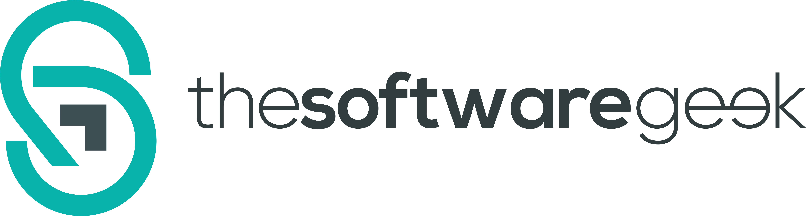

# Helm Charts

[](https://github.com/thesoftwaregeek/helm-charts/actions/workflows/release.yaml)
[](https://github.com/thesoftwaregeek/helm-charts/releases)

## Introduction

This repository contains [Helm](https://helm.sh) charts for various projects. The charts are available in the [thesoftwaregeek Helm Charts Repository](https://thesoftwaregeek.github.io/helm-charts).

## Usage

[Helm](https://helm.sh) must be installed to use the charts.
Please refer to Helm's [documentation](https://helm.sh/docs/) to get started.

Once Helm is set up properly, add the repository as follows:

```bash
helm repo add thesoftwaregeek https://thesoftwaregeek.github.io/helm-charts
```

You can then run `helm search repo thesoftwaregeek` to see the charts.

### Installing a Chart

To install a chart, use the following command:

```bash
helm install my-release thesoftwaregeek/<chart-name>
```

For example:

```bash
helm install my-argo-cd thesoftwaregeek/argo-cd
```

### Using OCI Registry

Our charts are also available as OCI artifacts. You can pull them directly from our GitHub Container Registry:

```bash
# Pull a specific chart version
helm pull oci://ghcr.io/thesoftwaregeek/charts/<chart-name> --version <version>

# Example
helm pull oci://ghcr.io/thesoftwaregeek/charts/aws-ebs-csi-driver --version 2.41.0-0
```

You can also install directly from the OCI registry:

```bash
helm install my-release oci://ghcr.io/thesoftwaregeek/charts/<chart-name> --version <version>
```

### Configuration

Each chart has its own values.yaml file with detailed configuration options. Please refer to the individual chart's README for specific configuration options.

### Adding a New Chart

To add a new chart to this repository:

1. Use our GitHub Action workflow to create the chart structure:
   - Go to Actions → Add Helm Chart
   - Click "Run workflow"
   - Fill in the required information:
     - Chart Repository Name (e.g., external-dns)
     - Chart Repository URL (e.g., https://kubernetes-sigs.github.io/external-dns/)
     - Chart Name (e.g., external-dns)
     - Chart Version (e.g., 1.15.0)
     - Docker Image Registry URL
     - Docker Image Version

2. The workflow will:
   - Create the basic chart structure
   - Add necessary files (Chart.yaml, values.yaml, README.md)
   - A Job Summary will then allow you to Create a pull request with your changes

3. Review the generated files and make any necessary adjustments

4. Once the PR is created:
   - Ensure all tests pass
   - Request review from maintainers
   - Address any feedback

### Development

To develop on this repository:

1. Fork this repository
2. Make your changes
3. Run tests if available
4. Submit a pull request

## Versioning

The charts in this repository follow [Semantic Versioning](https://semver.org/). The version numbers are automatically updated by Renovate bot.

## Security

### Reporting Security Issues

If you discover a security issue, please bring it to our attention right away!

Please **DO NOT** file a public issue, instead send your report privately to [security@thesoftwaregeek.com](security@thesoftwaregeek.io).

## Support

If you have any questions about this repository or its contents, please:

1. Check the documentation
2. Open a [GitHub Issue](https://github.com/thesoftwaregeek/helm-charts/issues)
